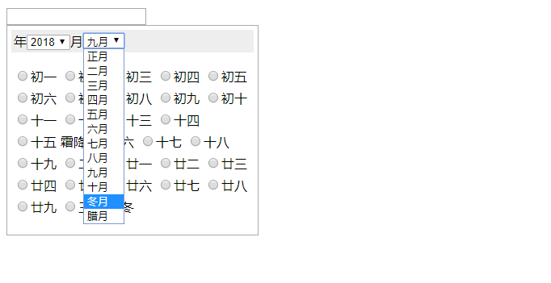

# tdull_LunarDate


## 简介
 本套日历现依赖于jQuery实现，存农历日期选择插件，ui请自行优化，数据是通过数据文件获得（lunar_dat_solar_map.js），不通过算法实现，发现数据错误可自行修改添加。

## 文件描述
  JS文件
    lunar_dat_solar_map.js 数据对象
    ht_lunar_date_cal.js 插件实现

## 功能列表
  * 支持的浏览器 Chrome 3+ 

## 截图
  

## 使用方法

  1. demo

  ```
<!DOCTYPE html>
<html lang="zh-cn">
    
    <head>
        <meta charset="utf-8" /></head>
        
        <script src="./jquery-3.3.1.min.js"></script>
        <script src="./js/lunar_dat_solar_map.js"></script>
        <script src="./js/ht_lunar_date_cal.js"></script>
        
    <body>
        <div style="widht:300px">
            <input id="date" />
        </div>
        <script>
            $(function($) {
                $("#date").tdull_LunarDate()
            });
        </script>
    </body>

</html>
  ```

  详细请参见index.html示例文件。

## Q/A
  联系方式：tao_huangtao@qq.com


## License
The MIT License (MIT)

Copyright (c) 2015 tdul.com

Permission is hereby granted, free of charge, to any person obtaining a copy
of this software and associated documentation files (the "Software"), to deal
in the Software without restriction, including without limitation the rights
to use, copy, modify, merge, publish, distribute, sublicense, and/or sell
copies of the Software, and to permit persons to whom the Software is
furnished to do so, subject to the following conditions:

The above copyright notice and this permission notice shall be included in all
copies or substantial portions of the Software.

THE SOFTWARE IS PROVIDED "AS IS", WITHOUT WARRANTY OF ANY KIND, EXPRESS OR
IMPLIED, INCLUDING BUT NOT LIMITED TO THE WARRANTIES OF MERCHANTABILITY,
FITNESS FOR A PARTICULAR PURPOSE AND NONINFRINGEMENT. IN NO EVENT SHALL THE
AUTHORS OR COPYRIGHT HOLDERS BE LIABLE FOR ANY CLAIM, DAMAGES OR OTHER
LIABILITY, WHETHER IN AN ACTION OF CONTRACT, TORT OR OTHERWISE, ARISING FROM,
OUT OF OR IN CONNECTION WITH THE SOFTWARE OR THE USE OR OTHER DEALINGS IN THE
SOFTWARE.

